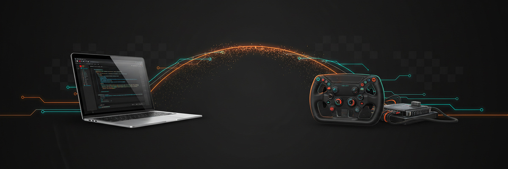

<p align="center">
  
</p>

# marshal

**Marshals device I/O across the Parallels boundary** — so Windows motorsport tuning
software running on an Apple‑Silicon Mac can actually talk to the hardware.

> A race *marshal* relays signals to the cars on track. In software, *marshalling* is moving
> data across a boundary. This does both: it carries device traffic across the boundary between
> macOS and a Windows‑on‑ARM virtual machine.

---

## The problem

You have an Apple‑Silicon Mac. You run Windows tuning software (AiM RaceStudio 3, Life Racing
LifeCal, ECUMaster PMU Client) in Parallels. The apps **launch fine** — but they **can't reach
the hardware**. Downloads fail, the device never connects.

One root cause sits under all of it:

> **Windows 11 on ARM runs your x64 *apps* under emulation, but it cannot load x64/x86
> *kernel‑mode drivers* — by design.**

Every one of these vendors ships an x64‑only kernel driver (a USB driver, a raw‑Ethernet NDIS
driver, a USB‑to‑CAN driver). None of them load in the ARM guest, so the app has nothing to
talk to.

## The idea

macOS itself can talk to all of this hardware in **userspace** — no kernel‑driver wall. So
marshal moves the device I/O to where a driver can run:

```text
 Windows guest (ARM)                    macOS host (Apple Silicon)
┌─────────────────────┐               ┌──────────────────────────────┐
│  vendor app         │   Parallels   │  marshald (this project)     │
│  opens COM3 / NIC ──┼── virtual ────┼─► device plugin ─► libusb ───┼─► 🔌 hardware
│                     │   serial/NIC  │                    / BPF      │
└─────────────────────┘   (host sock) └──────────────────────────────┘
```

- The **macOS daemon** (`marshald`) owns the real device and speaks its protocol.
- The guest reaches it through a **Parallels virtual serial port or NIC** backed by a host
  socket — using only Parallels' own ARM64‑signed components.
- **No third‑party kernel driver ever runs inside the guest.**

## Devices

| Device | Software | Link | Status |
|---|---|---|---|
| ECUMaster PMU16 | PMU Client | USB→CAN cable | ✅ Confirmed USB‑CDC (VID 0x0483/PID 0x5740) — free ARM64 COM port, no bridge |
| Life Racing ECU | LifeCal | Raw layer‑2 Ethernet | 📐 Designed — reimplement their protocol server on macOS |
| AiM SW4 | RaceStudio 3 | Native USB | 🔬 Protocol decoded (vendor control 0x42 + bulk 0x01/0x82, ASCII/XML; not HID). **Device-side relay built** & fixture-validated; guest-presentation forwarder is the open piece |

Sequenced easiest → hardest so the shared plumbing is proven before the hard device.

## Status

**Core daemon built; device plugins in progress.** What exists today:

- ✅ Full design spec — [`docs/superpowers/specs/2026-07-13-marshal-design.md`](docs/superpowers/specs/2026-07-13-marshal-design.md)
- ✅ A hardware **discovery kit** you run on the Mac with the devices — [`tools/usb-discovery/`](tools/usb-discovery/)
- ✅ **`marshald` core + serial bridge** — the daemon spine (config → plugin → bridge → per-device
  Unix socket → lifecycle), with `mock` and `serial` plugins. Loopback- and PTY-tested; `go test ./... -race` green.
- ✅ **AiM SW4 device-side relay** — the `internal/plugins/aim` libusb control/bulk transfer relay,
  validated **hardware-free** by replaying the captured USBPcap fixture (real-device build: `-tags aim_usb`).
  The guest-presentation forwarder (how RS3-in-guest reaches the socket) is the remaining piece.
- ⏳ The **Life Racing (raw-L2)** device plugin — not written yet.

No promises that any given device works until its row above says so. This README describes the
plan and the tools that get us there.

## Getting started

If you have the hardware, the first useful thing is to identify how each device enumerates.
On the Mac with the devices:

```sh
cd tools/usb-discovery
make ecumaster     # ECUMaster USB→CAN cable
make aim           # AiM SW4 (must be powered — 12V)
make ethernet      # USB→Ethernet adapter (Life Racing)
make bundle        # → one file to send back
```

See [`tools/usb-discovery/README.md`](tools/usb-discovery/README.md) for the walk‑through.

## Repository layout

```text
cmd/marshald/             the daemon entrypoint (Go)
internal/                 daemon packages: config, plugin, bridge, transport, daemon, plugins/{mock,serial,aim}
docs/superpowers/         design specs and implementation plans
tools/usb-discovery/       macOS hardware discovery kit (no build required)
tools/aim-capture/         Windows kit — SW4 driver/USB capture (runs in the guest or a real PC)
tools/ecumaster-check/     Windows kit — confirm the ECUMaster COM port in the guest
tools/aim-usbcap/          Windows kit — record RS3<->SW4 USB traffic (USBPcap, x64 PC)
tools/lifecal-capture/     Windows kit — Life Racing IPC + raw-frame capture (gets the Life Racing inputs)
tools/aim-open-trace/      Windows kit — trace how RS3 opens the SW4 (gets the guest-forwarder input)
```

The remaining device plugin (Life Racing raw-L2) lands under `internal/plugins/`.

## Non‑goals

marshal does **not** reimplement the vendors' GUIs, and it isn't a general Windows‑on‑ARM
driver shim. It bridges the specific devices listed above, and only the connection paths they
actually use.

---

*A Mile High Ideas project. Currently private — just the two of us.*
